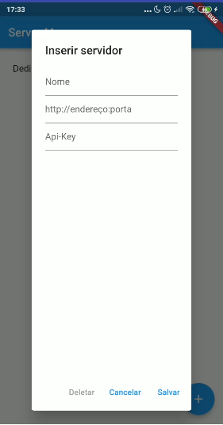
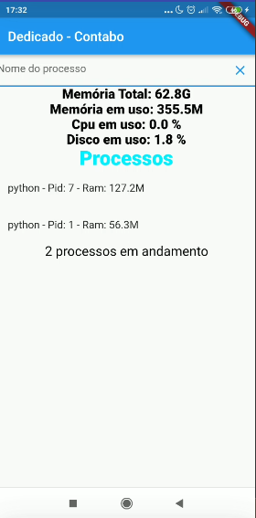

# Projeto Server Manager

Esse projeto consiste em uma conexão em tempo real usando socket.io entre um servidor e o aplicativo server manager. A fim de exibir métricas de uso do servidor.

# Requisitos

 * [Api Server Manager](https://github.com/brutalzinn/back-server-manager)
 * Porta 5555/TCP aberta no firewall
  
# Estrutura

.

# Capturas de tela

.

.

.

